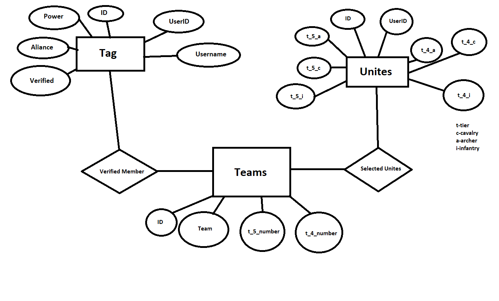

# Informatika 2. Nagyházi
  Kovács Bálint CIH0ND

# Csapattagok adatbázisa

# Specifikáció

## Feladat informális leírása

A feladat célja, hogy egy közöségen („királyságban”) belül a tagok adatait eltároljuk és hogy egy bizonyos tagnak mennyi katona áll rendelkezésére. Cél, hogy az tagokat kiválasztva csapatokba tudjuk rendezni különböző eseményekre a katonáik száma és típusa szerint.

## Elérhető funkciók
* Tagok kezelése :

	* Tag szerkesztése
	* Tag törlése
	* Új tag hozzáadása
	* Tagok keresése tagID alapján
* Tagok katonáinak kezelése:
	* Tag katonáinak szerkesztése
	* Tag katonáinak törlése
	* Új tag katonáinak hozzáadása
	* Tagok katonáinak keresése tagID alapján
* Csapatok kezelése:
	* Új tag berakása egy már meglévő csapatba (csakis olyan tag aki még nem szerepel egyik csapatban sem)
	* Tag törlése egy csapatból

## Adatbázis:
Az adatbázisban a következő entitásokat és attribútumokat tároljuk:

	 Member:  userid , username , poewr , aliance , verified
	 Units: userid , t_5_a , t_5_c , t_5_i , t_4_a , t_4_c , t_4_i (t-tier , a-archer , c –cavalry , i-infantry)
	 Team: member , unites , team , t_5_number , t_4_number

A fenti adatok tárolását az alábbi sémával oldjuk meg:

